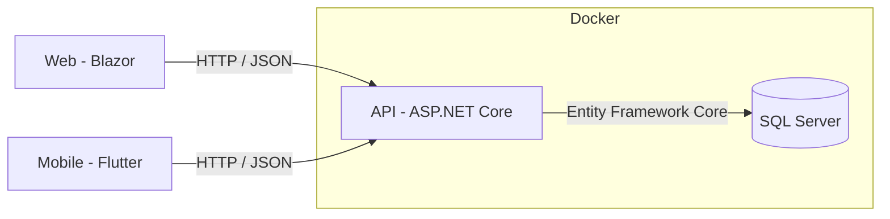

# Arquitetura

Web e mobile falam só com a API. Só a API fala com o banco. Isso é exigência do projeto e também a forma certa: as regras de cálculo e de segurança ficam num lugar só.

## Tecnologias e o papel de cada uma

| Parte | Tecnologia | Linguagem | O que faz |
| --- | --- | --- | --- |
| Web | Blazor (Interactive Server) | C# | Telas de cadastro, carregamento e relatórios |
| Mobile | Flutter | Dart | Consulta e conferência pelo celular |
| API | ASP.NET Core (minimal API, .NET 10) | C# | Regras de negócio, validação, cálculo, acesso ao banco |
| Domínio | Biblioteca de classes | C# | Entidades (`Truck`, `CargoItem`) e, de preferência, as regras de cálculo |
| Infraestrutura | Entity Framework Core | C# | Mapeamento das tabelas (`CubagemDbContext`) |
| Banco | SQL Server 2022 | SQL | Guarda os dados |
| Ambiente | Docker Compose | YAML | Sobe API e banco com um comando |

## Por que separar em projetos

- **Domain** não depende de nada. Dá para testar o cálculo sem banco e sem API.
- **Infrastructure** sabe falar com o banco.
- **Api** junta tudo e expõe os endpoints.

Sugestão: mover as contas (volume, ocupação, peso cubado, "cabe?") de `TruckEndpoints.cs` para uma classe no Domain, por exemplo `CubageCalculator`. Fica mais fácil de testar e de explicar no trabalho.

## Endpoints atuais

| Método | Rota | O que faz |
| --- | --- | --- |
| GET | `/api/trucks` | Lista caminhões com cargas e cálculos |
| POST | `/api/trucks` | Cria caminhão |
| DELETE | `/api/trucks/{id}` | Exclui caminhão (e suas cargas) |
| POST | `/api/trucks/{id}/cargo` | Adiciona item de carga |
| DELETE | `/api/trucks/{id}/cargo/{cargoId}` | Remove item |
| GET | `/api/status` | Status da API |
| GET | `/health` | Health check |

## Portas

| Como roda | API |
| --- | --- |
| Docker Compose | `http://localhost:8080` |
| `dotnet run` | `http://localhost:5242` |
| Emulador Android acessando a máquina | `http://10.0.2.2:8080` |

O Blazor hoje aponta para `5242`. Se a API estiver no Docker, precisa ser `8080` (veja [Estado atual](08-estado-atual.md)).
