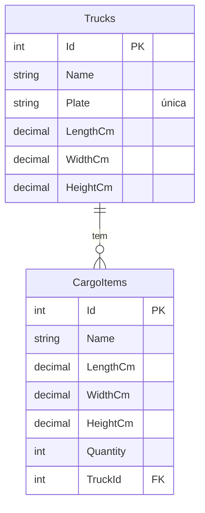
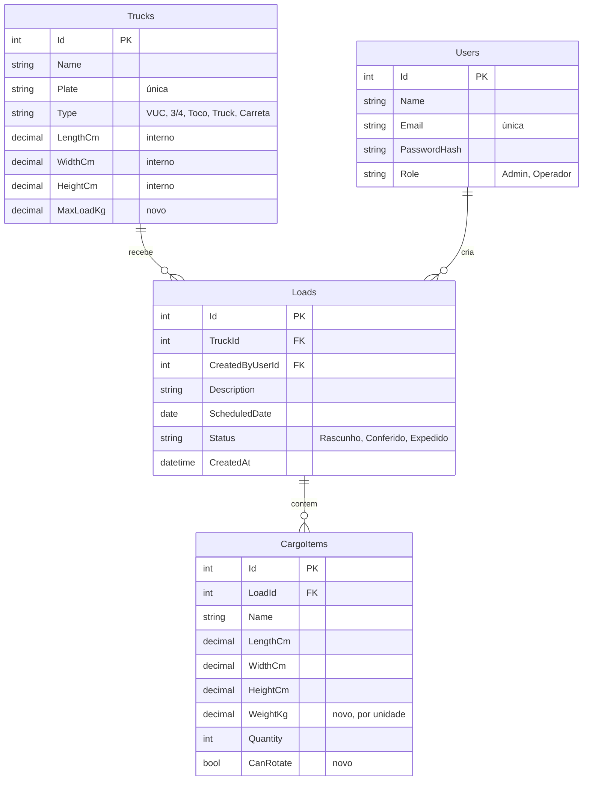

# Modelo de dados

Hoje são duas tabelas. A sugestão é chegar a quatro, sem complicar.

## Atual

Problema: a carga fica presa direto no caminhão. Não dá para ter histórico ("o que o caminhão levou semana passada") nem planejar dois carregamentos para o mesmo veículo.

## Sugerido

Notas:

- **Loads** (carregamento) liga caminhão e itens. É a mudança mais importante.
- Os resultados (volume, ocupação, peso cubado) **não** são gravados: são calculados na hora pela API. Assim nunca ficam desatualizados.
- Fator de aproveitamento e fator de cubagem podem ficar no `appsettings.json` da API. Uma tabela de configuração é opcional.
- **Users** só é necessária se o grupo fizer login. Se usar ASP.NET Core Identity, ele cria as próprias tabelas de usuário.

## Migrations

Hoje a API usa `EnsureCreatedAsync()`, que cria o banco mas não sabe alterá-lo depois. Ao adicionar campos, o banco antigo não muda. Trocar por migrations do EF Core (`dotnet ef migrations add` e `Database.MigrateAsync()`) resolve isso e é um bom ponto para mostrar no trabalho.
